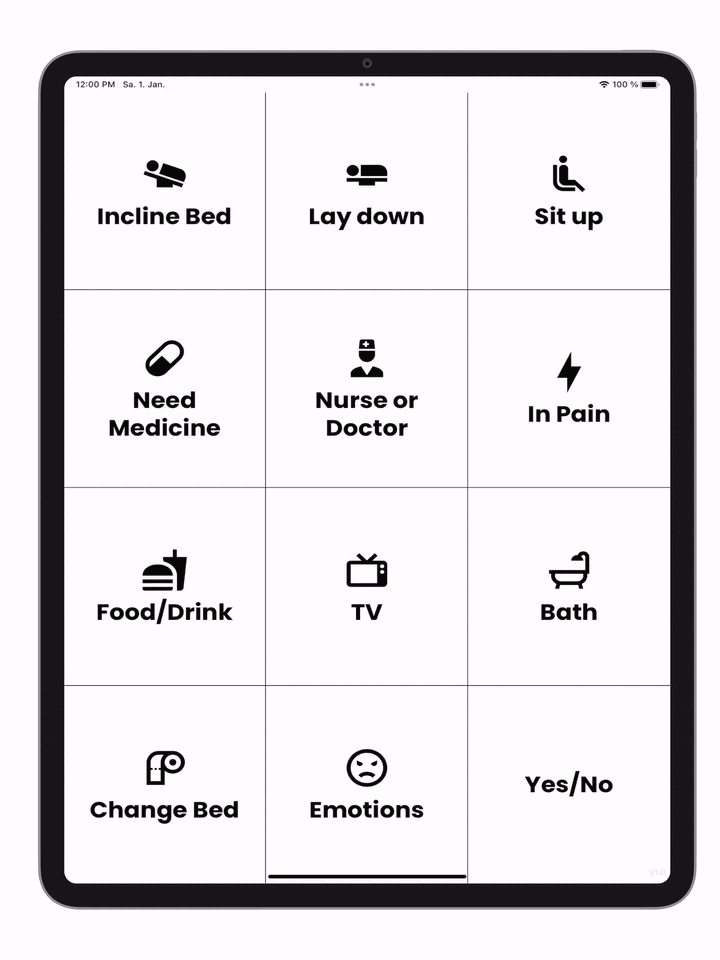

<div align="center">
<h1 align="center">
Aphasia-App
</h1>
</div>


<div align="center">

</div>

<div align="center">
<a href="https://spreakfark.github.io/Aphasia-App/">
Open Application &rarr;
</a>
</div>


---
This application was inspired by [this YouTube video](https://youtu.be/JavCEJ5hodc)
## Features

- Over 30+ unique buttons for optimal communication
- Speech synthesis
- Installable on mobile as a (PWA) App
- Fully responsive UI

## Development
1. Clone Repository
``` bash
$ git clone https://github.com/spreakfark/Aphasia-App.git
$ cd Aphasia-App
```
2. Install dependencies
``` bash
$ npm install
```
3. Start development server 
``` bash
$ npm run dev
```

Build and deploy from source
``` bash
$ npm run build
$ npm run deploy
```